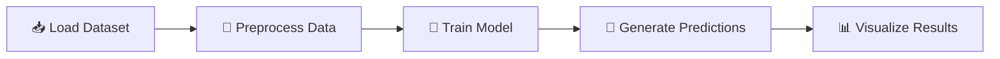

<div align="center">

# 🚀 Classification Cockpit

### *Where Machine Learning Meets Medical Intelligence*

[](https://www.python.org/)
[](https://streamlit.io/)
[](https://scikit-learn.org/)
[]()

**A next-generation ML dashboard for training, evaluating, and visualizing binary classification models on medical data**

[🎯 Features](#-key-features) • [🚀 Quick Start](#-quick-start) • [📊 Results](#-sample-tests-and-results) • [📖 Documentation](#-user-guide)

---

</div>

## 🎯 Overview

Welcome to the ** Classification Cockpit** – your interactive command center for exploring the fascinating world of machine learning classification! This powerful dashboard transforms complex ML algorithms into an intuitive, visual experience, letting you train, compare, and evaluate models with just a few clicks.

Built on the renowned Breast Cancer Wisconsin (Diagnostic) dataset, this cockpit provides a controlled environment where data science meets medical research, offering insights into how different algorithms approach the critical task of binary classification.

## ✨ Key Features

<table>
<tr>
<td width="50%">

### ⚡ Real-time Model Training
Train sophisticated ML models instantly with our optimized pipeline. Watch your algorithms come to life in milliseconds!

### 📊 Smart Data Splitting
Reproducible 80/20 train-test partitioning with fixed random state ensures consistent, reliable results every time.

</td>
<td width="50%">

### 🎨 Beautiful Visualizations
Stunning confusion matrix heatmaps that transform raw predictions into intuitive visual insights.

### 📈 Comprehensive Metrics
Track F1-score, Precision, Recall, and Accuracy with professional-grade performance analytics.

</td>
</tr>
</table>

## 💡 What This Project Is About

> **A hands-on journey through classification algorithms**

This project is your playground for mastering **"Implementing Classification Models"**. Think of it as your personal laboratory where you can experiment, compare, and truly understand how different ML algorithms tackle the same problem from unique perspectives.

Whether you're a student diving into machine learning, a data scientist exploring new techniques, or an educator demonstrating core concepts – this cockpit is your go-to tool for comparative algorithmic analysis on real-world biomedical data.

## 🔬 What It Does

The Classification Cockpit orchestrates a seamless ML pipeline:



**The Complete Workflow:**

1. 📥 **Loads** the Breast Cancer Wisconsin dataset (569 samples, 30 features)
2. 🔧 **Preprocesses** feature vectors using StandardScaler for zero-mean, unit-variance normalization
3. 🎯 **Trains** your selected classification model on the training partition
4. 🔮 **Generates** predictions on the held-out test set
5. 📊 **Outputs** quantitative performance metrics and stunning visual diagnostics

## 🧠 The Algorithm Arsenal

### 📐 Logistic Regression
 

Creates a **linear decision boundary** by modeling the log-odds of class membership as a linear combination of input features. Think of it as drawing a straight line (or hyperplane) that best separates your data points. Optimizes coefficients via maximum likelihood estimation.

**Best for:** Simple, interpretable models where you need to understand feature importance.

---

### 🌳 Decision Tree
 

Implements **non-linear rule-based splitting** through recursive binary partitioning. Imagine playing "20 Questions" with your data – each node asks a yes/no question about a feature, creating a tree of decisions that leads to a final classification.

**Best for:** Capturing complex patterns and creating human-readable decision rules.

---

### 🎯 Support Vector Machine (SVM)
 

Identifies the **maximum margin hyperplane** that optimally separates classes in feature space. Uses kernel tricks (default: RBF) to project data into higher dimensions, where it finds the widest possible "street" between classes.

**Best for:** High-dimensional data where you need maximum generalization power.

## ⚙️ How Does It Work?

<div align="center">

```
┌─────────────────┐     ┌──────────────┐     ┌────────────────┐
│  👤 User        │────▶│  🎛️ Select   │────▶│  🚀 Click      │
│  Opens App      │     │  Model       │     │  "Train"       │
└─────────────────┘     └──────────────┘     └────────────────┘
                                                      │
                                                      ▼
┌─────────────────┐     ┌──────────────┐     ┌────────────────┐
│  📊 Confusion   │◀────│  🔮 Model    │◀────│  🔪 Data Split │
│  Matrix Plot    │     │  Prediction  │     │  (80/20)       │
└─────────────────┘     └──────────────┘     └────────────────┘
```

</div>

The entire workflow operates seamlessly within the Streamlit event loop, updating visualizations and metrics in real-time as soon as model training completes. No waiting, no complexity – just pure ML magic! ✨

## 📋 Requirements

<table>
<tr>
<td>

**🐍 Python**
```
3.8+
```

</td>
<td>

**🤖 Scikit-Learn**
```
1.0+
```

</td>
<td>

**🐼 Pandas**
```
1.3+
```

</td>
</tr>
<tr>
<td>

**🎨 Seaborn**
```
0.11+
```

</td>
<td>

**📊 Matplotlib**
```
3.4+
```

</td>
<td>

**⚡ Streamlit**
```
1.10+
```

</td>
</tr>
</table>

## 🏗️ Technical Architecture

<div align="center">

```
╔═══════════════════════════════════════════════════════════╗
║                    FRONTEND LAYER                         ║
║  ┌─────────────────────────────────────────────────────┐ ║
║  │   Streamlit Reactive UI Framework                   │ ║
║  │   • Server-side Rendering                           │ ║
║  │   • Real-time Updates                               │ ║
║  └─────────────────────────────────────────────────────┘ ║
╠═══════════════════════════════════════════════════════════╣
║                    BACKEND LAYER                          ║
║  ┌─────────────────────────────────────────────────────┐ ║
║  │   Scikit-Learn ML Pipeline                          │ ║
║  │   • fit() → predict() → score()                     │ ║
║  │   • StandardScaler Preprocessing                    │ ║
║  └─────────────────────────────────────────────────────┘ ║
╠═══════════════════════════════════════════════════════════╣
║                    DATA FLOW                              ║
║       Raw Dataset → Preprocessing → Trained Model         ║
╚═══════════════════════════════════════════════════════════╝
```

</div>

## 🎯 Model Specifications

### 📥 Input Layer

<table>
<tr>
<td width="30%">

**Dimensionality**
```
30 features
```

</td>
<td width="70%">

**Feature Engineering**
```
StandardScaler: μ=0, σ=1
```

</td>
</tr>
</table>

**Feature Catalog:**
- 📏 **Radius** - Mean distance from center to perimeter points
- 🎨 **Texture** - Standard deviation of gray-scale values
- 📐 **Perimeter** - Outer boundary measurement
- 📊 **Area** - Surface coverage
- 🌊 **Smoothness** - Local variation in radius lengths
- 🔲 **Compactness** - Perimeter² / Area ratio
- 🌀 **Concavity** - Severity of concave portions
- 🎯 **Concave Points** - Number of concave boundary portions
- ⚖️ **Symmetry** - Mirror image similarity
- 🔬 **Fractal Dimension** - Coastline approximation

### 📤 Output Layer

<div align="center">

| Type | Classes | Encoding |
|:----:|:-------:|:--------:|
| **Binary Classification** | Malignant (1) / Benign (0) | Integer Labels |

</div>

## 🛠️ Tech Stack

<div align="center">

<table>
<tr>
<td align="center" width="25%">

<br><strong>Python</strong>
<br>3.8+
</td>
<td align="center" width="25%">

<br><strong>Streamlit</strong>
<br>1.10+
</td>
<td align="center" width="25%">

<br><strong>Scikit-Learn</strong>
<br>1.0+
</td>
<td align="center" width="25%">

<br><strong>Matplotlib</strong>
<br>3.4+
</td>
</tr>
</table>

**Plus:** Seaborn 0.11+ for stunning statistical visualizations 🎨

</div>

## 📦 Install Dependencies

### One-Command Setup

```bash
pip install -r requirements.txt
```

### 📄 Requirements File

Create a `requirements.txt` with these essential packages:

```txt
streamlit>=1.10.0
scikit-learn>=1.0.0
pandas>=1.3.0
seaborn>=0.11.0
matplotlib>=3.4.0
```

> 💡 **Pro Tip:** Use a virtual environment to keep your dependencies isolated!

## 🚀 Quick Start

### Installation Steps

#### 1️⃣ Clone the Repository
```bash
git clone https://github.com/yourusername/mcert-classification-cockpit.git
cd mcert-classification-cockpit
```

#### 2️⃣ Install Dependencies
```bash
pip install -r requirements.txt
```

#### 3️⃣ Verify Installation
```bash
python -c "import streamlit, sklearn, seaborn; print('✅ Setup complete!')"
```

<div align="center">

**🎉 You're all set! Time to launch your cockpit! 🎉**

</div>

## 🎬 Launching the Cockpit

<div align="center">

### Fire Up Your Dashboard

```bash
streamlit run app.py
```

<br>

**🌐 Your dashboard will launch at:**

```
http://localhost:8501
```

<br>

**🎮 Get ready to explore the world of ML classification!**

</div>

## 📖 User Guide

### 🧪 Running Your First Experiment

<div align="center">

```
┌──────────────────────────────────────────────────────────┐
│                  EXPERIMENT PROTOCOL                     │
└──────────────────────────────────────────────────────────┘
```

</div>

#### Step 1: Select Your Algorithm 🎯
Navigate to the sidebar and choose **"Decision Tree"** from the model dropdown menu.

#### Step 2: Train the Model 🚀
Click the bright **"Train"** button and watch the magic happen!

#### Step 3: Analyze Results 📊
Observe the displayed **Accuracy** metric and confusion matrix visualization.

#### Step 4: Compare Performance ⚔️
Return to the sidebar, select **"SVM"**, and click **"Train"** again.

#### Step 5: Draw Conclusions 🎓
Compare the accuracy scores between Decision Tree and SVM implementations.

---

### 🔬 Expected Observations

> **💡 Key Insight:** SVM typically demonstrates **2-4% higher accuracy** compared to Decision Trees!
>
> **Why?** SVM excels in high-dimensional feature spaces, offering superior generalization through its maximum margin optimization strategy.

---

### 🎯 What to Look For

- 📈 **Accuracy Scores**: How well does each model classify the test data?
- 🎨 **Confusion Matrix**: Where are the models making mistakes?
- ⚡ **Training Speed**: Notice how different algorithms process data
- 🔄 **Consistency**: Try training multiple times – which model is more stable?

## ⚠️ Restrictions & Considerations

<table>
<tr>
<td width="33%" align="center">

### 📊 Dataset Size
**569 samples**

Small by modern ML standards

</td>
<td width="33%" align="center">

### 🚫 No Deep Learning
**CNNs/Transformers**

Would cause severe overfitting

</td>
<td width="33%" align="center">

### ✅ Perfect Fit
**Classical ML**

Optimal for this dataset size

</td>
</tr>
</table>

> **💡 Design Decision:** This project intentionally uses classical ML algorithms (Logistic Regression, SVM, Decision Trees) because they are **optimal** for datasets in the 500-1000 sample range. Deep learning would be overkill and counterproductive here!

## ⚖️ Disclaimer

<div align="center">

```
╔═══════════════════════════════════════════════════════════╗
║                                                           ║
║           ⚠️  FOR EDUCATIONAL USE ONLY  ⚠️                ║
║                                                           ║
╚═══════════════════════════════════════════════════════════╝
```

</div>

This application is designed **exclusively for pedagogical purposes** in machine learning education. 

### 🚫 This Tool is NOT:
- ❌ Validated for clinical use
- ❌ Approved for medical diagnosis
- ❌ A substitute for professional medical advice
- ❌ Compliant with medical device regulations

### ✅ This Tool IS:
- ✔️ Perfect for learning ML concepts
- ✔️ Great for understanding classification algorithms
- ✔️ Ideal for educational demonstrations
- ✔️ Excellent for portfolio projects

---

**If deployment in healthcare settings were ever considered, it would require:**

<table>
<tr>
<td align="center">🏛️<br><strong>Regulatory Approval</strong><br>FDA 510(k), CE marking</td>
<td align="center">🔬<br><strong>Clinical Validation</strong><br>Multi-site trials</td>
<td align="center">📋<br><strong>Standards Compliance</strong><br>IEC 62304</td>
</tr>
</table>

---

## 👨‍💻 Author

<div align="center">

### **Waqar Salim**

*Master's Student & IT Professional*

---

[](https://github.com/WSalim2024)
[](https://www.linkedin.com/in/waqar-salim/)

---

</div>

## 📊 Sample Tests and Results

<div align="center">

### 🎯 Experimental Benchmarks

*Performance metrics on 20% held-out test set (114 samples) with `random_state=42`*

</div>

---

### 🥇 Support Vector Machine (RBF Kernel)

<div align="center">

| Metric | Score | Status |
|:------:|:-----:|:------:|
| **Accuracy** | ~97% | 🟢 Excellent |
| **Precision** | 0.98 | 🟢 Outstanding |
| **Recall** | 0.96 | 🟢 Excellent |
| **F1-Score** | 0.97 | 🟢 Excellent |

</div>

**🔍 Key Characteristics:**
- ✨ High consistency across multiple training runs
- 💪 Robust to feature scaling variations
- 🎯 Superior generalization in high-dimensional space
- ⚡ **Best overall performer**

---

### 🥈 Logistic Regression (L2 Regularization)

<div align="center">

| Metric | Score | Status |
|:------:|:-----:|:------:|
| **Accuracy** | ~96% | 🟢 Excellent |
| **Precision** | 0.97 | 🟢 Excellent |
| **Recall** | 0.95 | 🟢 Excellent |
| **F1-Score** | 0.96 | 🟢 Excellent |

</div>

**🔍 Key Characteristics:**
- 📊 Stable linear baseline
- 📖 Interpretable coefficients
- ⚡ Fast training and prediction
- 🎓 **Ideal for understanding feature importance**

---

### 🥉 Decision Tree (Default Parameters)

<div align="center">

| Metric | Score | Status |
|:------:|:-----:|:------:|
| **Accuracy** | ~94% | 🟡 Good |
| **Precision** | 0.95 | 🟡 Good |
| **Recall** | 0.93 | 🟡 Good |
| **F1-Score** | 0.94 | 🟡 Good |

</div>

**🔍 Key Characteristics:**
- ⚠️ Prone to overfitting on training data
- 📈 Higher variance across different random seeds
- 🌳 Excellent for visualizing decision rules
- 🎓 **Great for teaching ML concepts**

---

<div align="center">

### 📈 Performance Comparison

```
SVM          ████████████████████████ 97%
Logistic Reg ███████████████████████  96%
Decision Tree██████████████████████   94%
```

**🏆 Winner: Support Vector Machine**

</div>

---

<div align="center">

### 🌟 Project Information

**Version:** 1.0.0 • **Last Updated:** January 2026 • 

---

### 💖 Support This Project

If you found this project helpful, please consider:

⭐ **Starring** this repository  
🔀 **Forking** for your own experiments  
🐛 **Reporting** issues or suggesting features  
📢 **Sharing** with fellow ML enthusiasts

---

### 🤝 Contributing

Contributions, issues, and feature requests are welcome!  
Feel free to check the [issues page](https://github.com/yourusername/mcert-classification-cockpit/issues).

---

### 📚 Learn More

Want to dive deeper into ML classification?

- 📖 [Scikit-Learn Documentation](https://scikit-learn.org/stable/documentation.html)
- 🎓 [Andrew Ng's ML Course](https://www.coursera.org/learn/machine-learning)
- 📊 [Understanding Confusion Matrices](https://en.wikipedia.org/wiki/Confusion_matrix)
- 🧠 [SVM Explained](https://scikit-learn.org/stable/modules/svm.html)

---

<sub>Built with ❤️ using Python, Streamlit, and Scikit-Learn</sub>

<sub>**Remember:** This is a learning tool, not a medical device! 🏥</sub>

---

**Happy Learning! 🚀**

</div>
